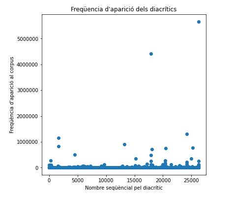

# Introducció

L'objectiu d'aquest projecte és analitzar de forma quantitativa l'ús de paraules que es diferencien només per l'accent diacrític (p. ex. llàstima/llastima) i que potencialment poden ser errors comuns per tal de:
* Entendre quin espectre d'aquest tipus de paraules cobreixen les regles actuals
* Identificar regles noves que podem crear de forma sistemàtica per solucionar aquests casos

Al LanguageTool tenim més de 3500 de regles que han anat creixent amb els anys per a identificar aquests errors.

# Dades

Tenim 1.179.865 formes al diccionari, d'aquestes 888.650 són úniques ja que al diccionari tenim una entrada per forma i funció gramatical (per exemple «que» té tres entrades, una per cada funció que té).

De les 888.650 formes, 60.689 (6.83%) són formes que existeixen amb versió amb diacrític i sense. D'aquestes 45416 (74.83%) les troben als nostres corpus, és a dir, tenim exemples del seu ús. Les que no trobem als corpus, són formes extremadament poc freqüents, un 95.89% de són formes verbals que s'usen molt poc.

El següent pas és entendre la freqüència d'aparició d'aquests parells (per exemple  bàsquet/basquet) als corpus, això ens dóna un senyal clar de si s'usen o no freqüentment.

# Resultats del projecte (18 desembre)

* Ens ha permés identificar formes molt poc freqüents i ja no usades en el diccionari que existeixen en versió amb accent i llevar-les dels diccionaris
* S'ha millorat la regla que detectava formes balears
* Hem creat una regla que basat amb la freqüència d'aparició de la paraula amb accent o sense (per exemple, 95% que aquesta paraula va sempre va amb accent) ho suggereixi

